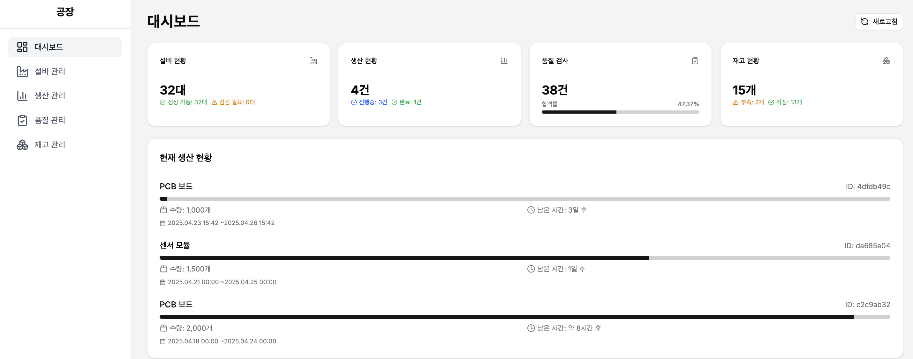
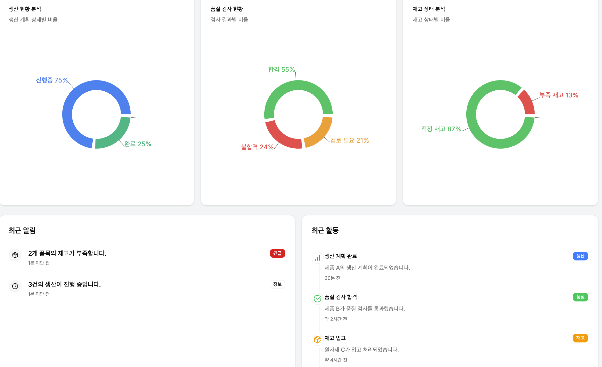
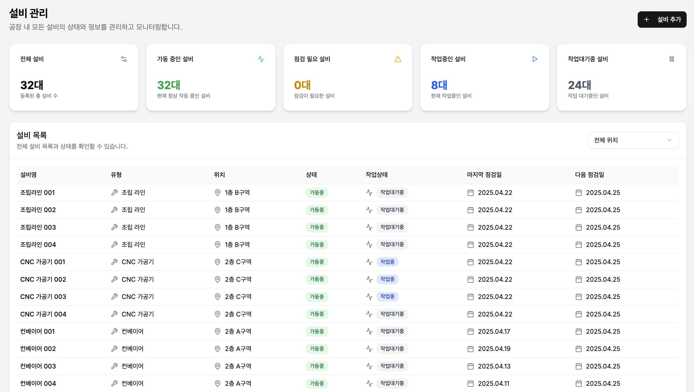
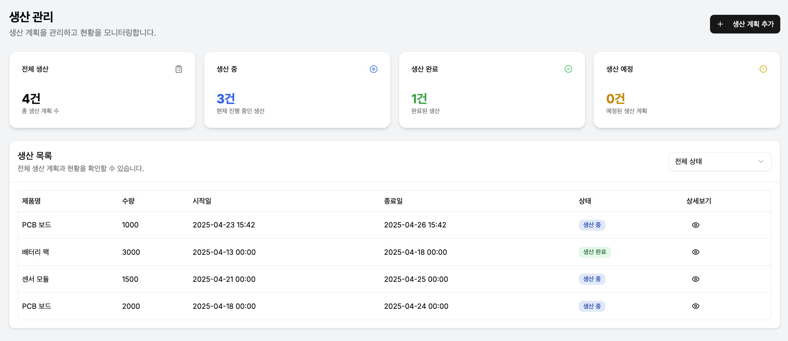
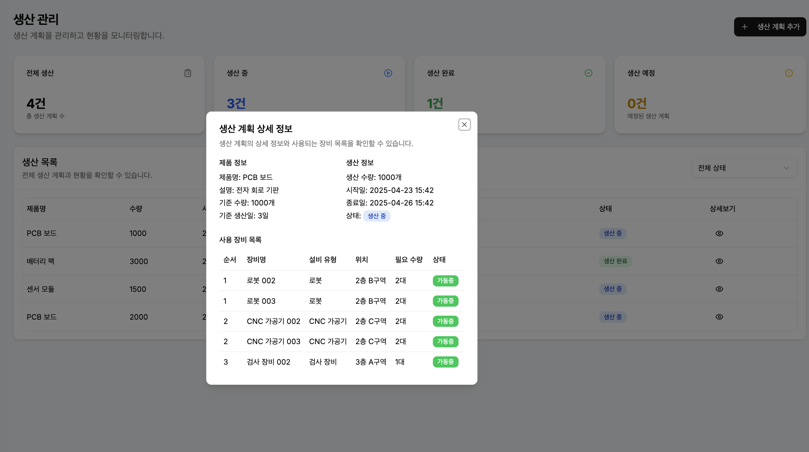
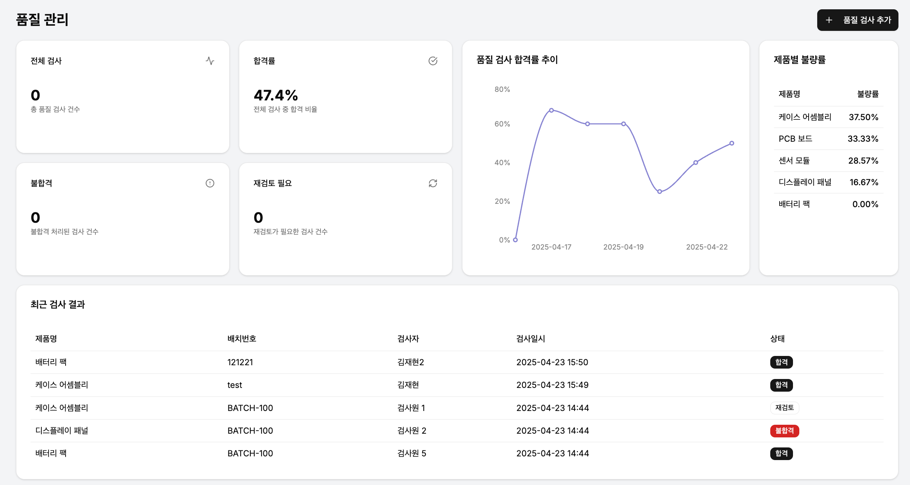
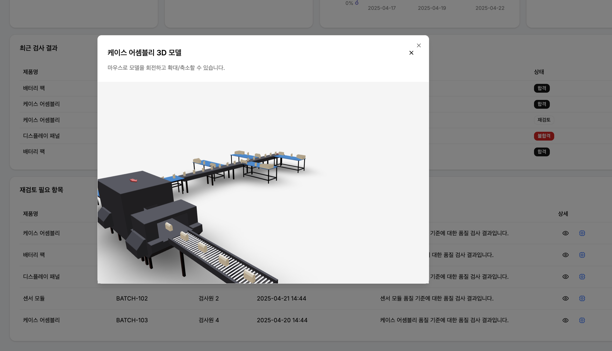
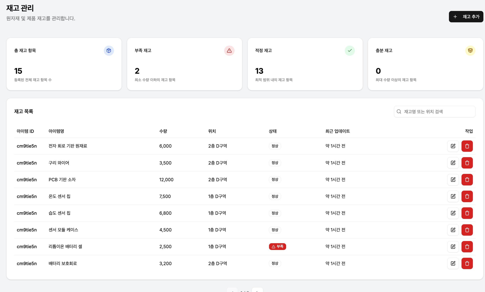

# 스마트 팩토리 관리 시스템

스마트 팩토리 관리 시스템은 현대 제조 환경을 효율적으로 관리하기 위한 종합 솔루션입니다. 이 웹 기반 시스템은 설비 관리, 생산 관리, 품질 관리, 재고 관리를 통합적으로 제공합니다.

## 주요 기능

### 대시보드
실시간 생산 현황, 품질 통계, 설비 상태, 재고 현황을 한눈에 파악할 수 있습니다.





### 설비 관리
공장 내 모든 장비의 상태 모니터링 및 유지보수 일정을 관리합니다.



### 생산 관리
생산 계획 수립, 진행 상황 추적, 생산성 분석을 제공합니다.





### 품질 관리
품질 검사 기록, 불량률 분석, 품질 개선 추적 기능을 제공합니다.





### 재고 관리
원자재 및 완제품 재고 수준 모니터링, 적정 재고 유지 기능을 제공합니다.



## 기술 스택

- **Frontend**: TypeScript, React, Next.js, Tailwind CSS, shadcn/ui
- **Backend**: Next.js API Routes
- **상태 관리**: React Query, Recoil
- **데이터베이스**: MySQL (with Prisma ORM)
- **폼 처리**: React Hook Form, Zod
- **API 통신**: Axios
- **인증**: JWT, Next-Auth
- **테스트**: Jest

## 설치 방법

### 사전 요구사항

- Node.js 18.0.0 이상
- MySQL 8.0 이상
- npm 또는 yarn

### 설치 단계

1. 저장소 클론
   ```bash
   git clone https://github.com/yourusername/smart-factory.git
   cd smart-factory
   ```

2. 의존성 설치
   ```bash
   npm install
   # 또는
   yarn install
   ```

3. 환경 변수 설정
   ```bash
   cp .env.example .env
   # .env 파일을 편집하여 필요한 값 입력
   ```

4. 데이터베이스 설정
   ```bash
   npx prisma migrate dev
   npx prisma db seed
   ```

5. 개발 서버 실행
   ```bash
   npm run dev
   # 또는
   yarn dev
   ```

6. 브라우저에서 `http://localhost:3000` 접속

## 환경 변수 설정

`.env` 파일에 다음 변수들을 설정해야 합니다:

- `DATABASE_URL`: Prisma 데이터베이스 연결 문자열
- `DB_NAME`, `DB_USER`, `DB_PASS`, `DB_HOST`, `DB_PORT`: 데이터베이스 연결 정보
- `NEXTAUTH_SECRET`: Next-Auth 암호화 키
- `NEXTAUTH_URL`: 애플리케이션 URL (기본값: http://localhost:3000)
- `JWT_SECRET`: JWT 토큰 암호화 키

## 배포

프로덕션 배포를 위해 다음 명령어를 실행하세요:

```bash
npm run build
npm start
# 또는
yarn build
yarn start
```

## 라이센스

[MIT](LICENSE)
